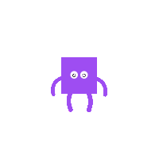

# APEX Lottie Animations

## Introduction
APEX Lottie Animations is a collection of Oracle APEX plugins that enable seamless integration of Lottie animations into your APEX applications. With support for template, region components, and dynamic actions, these plugins allow you to add, control, and interact with high-quality, scalable animations to enhance the user experience.

Lottie animations are vector-based, ensuring smooth playback across different devices and screen sizes. This plugin provides a straightforward way to load and control these animations, making it ideal for adding dynamic, eye-catching content to your APEX applications without sacrificing performance.

<div align="center">
  

  

  

  
</div>

### Plugins Included
- **Template Component Plugin**: Add Lottie animations directly into APEX with a Template component.
- **Region Plugin**: Embed Lottie animations within APEX regions.
- **Dynamic Action Plugin**: Control the playback of Lottie animations—play, pause, or stop—through dynamic actions triggered by user interactions.

## Installation

1. **Download the Plugin Files**  
   Clone or download the repository to your local machine.

   ```bash
   git clone https://github.com/kevintech/apex_lottie_animations.git
   ```

2. **Import the Plugins into Oracle APEX**
   - Navigate to your Oracle APEX application.
   - Go to **Shared Components** > **Plugins** > **Import**.
   - Select the appropriate plugin SQL files from the `plugins` folder in this repository.
   - Follow the prompts to complete the installation for each plugin.

3. **Configure the Plugins**
   - After importing, add the plugins to your page as a Template or Region.
   - Configure the plugin attributes as required.

## Plugin Attributes

### Template and Region Plugin Attributes
- **Lottie File URL**: URL of the Lottie JSON file containing the animation data. Find lottie files [here](https://lottiefiles.com/).
- **Size Unit (pixels, percentage)**: Choose between pixels (px) for fixed size or percentage (%) for responsive sizing.
- **Width**: Set the width of the animation using the selected size unit.
- **Height**: Set the height of the animation using the selected size unit.
- **Auto-play (y/n)**: Enable or disable automatic playback of the animation on page load.
- **Loop (y/n)**: Choose whether the animation should loop continuously or play only once.
- **Duration (milliseconds)**: Specify the total duration of the animation in milliseconds to control playback speed.
- **Speed (speed 1x, 2x, etc...)**: Adjust the animation speed by setting a multiplier (e.g., 1x for normal speed, 2x for double speed).

### Dynamic Action Plugin Attributes
- **Action Type**: Choose the type of action to be triggered (Play, Pause, Stop).
- **Target Animation**: Specify the Lottie animation (template or region) that the dynamic action will control.

## Using the Dynamic Action Plugin

1. **Add the Dynamic Action Plugin to Your Page**
   - In your APEX app, open the page where you want to control the animation.
   - Navigate to **Dynamic Actions** and create a new dynamic action.
   - Choose the **Lottie Animation Control** dynamic action from the available list.

2. **Configure the Dynamic Action**
   - Set the **Action Type** to define what you want to do with the animation (Play, Pause, Stop).
   - Specify the **Target Animation** to indicate which Lottie animation the dynamic action should control.

3. **Trigger the Dynamic Action**
   - Set up an event (e.g., button click, page load) that triggers the dynamic action, and watch as your animations respond in real time.

## Support
If you encounter any issues or have questions, please feel free to reach out:

- **Email**: [hello@kevintech.ninja](mailto:hello@kevintech.ninja)
- **GitHub Issues**: Open an issue in this repository.

---

Feel free to fork this project, submit issues, or contribute!